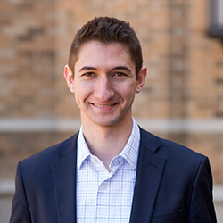

Welcome! I am a Ph.D. student in the department of political science at the University of Notre Dame, where I do research in the areas of comparative political theory (CPT) and public law.

Prior to coming to Notre Dame, I received my B.A. in political science from Pomona College.

I am originally from Newton, Massachusetts.
